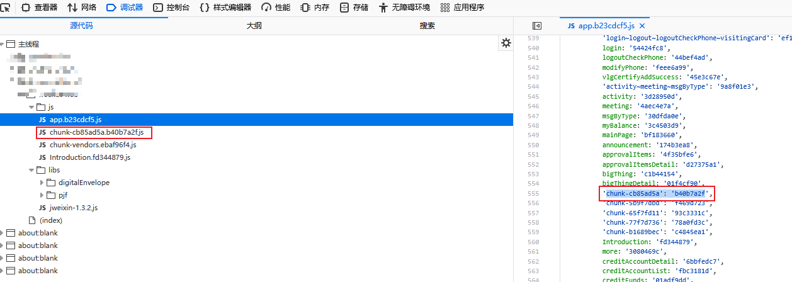
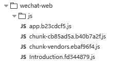
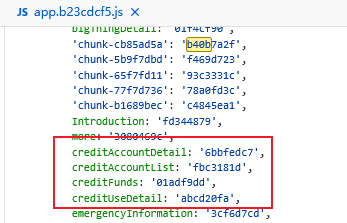
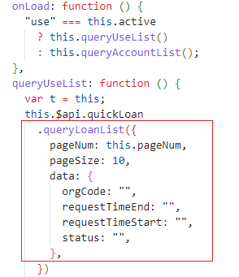
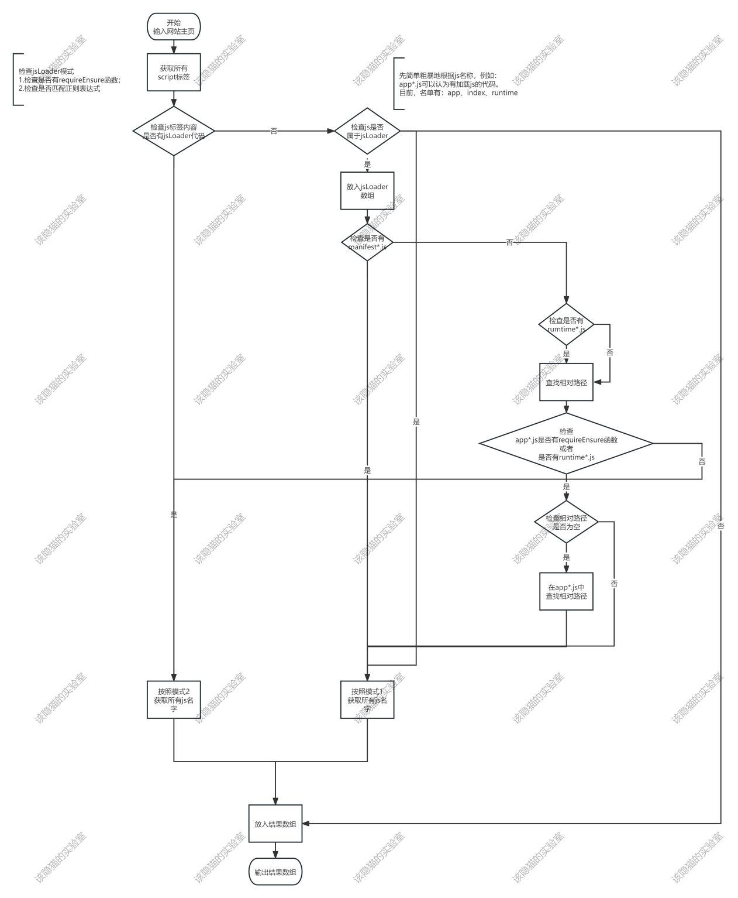

# 背景
单页模式的前端应用在打包时会将所有js文件的名字放到一个数组中。如下图所示，红框中js文件的名字可以在“app.b23cdcf5.js”中找到。

这就意味着，攻击者可以拿到目标所有的js文件，即使没有相应的权限。例如，一个系统同时给游客和管理员两个角色提供服务。攻击者以游客身份登陆后，可以利用单页模式的特性获得包含管理员功能的js文件。文件里面必然包含相应的接口。接口一旦存在越权问题，轻则暴露敏感信息，重则为攻击者入侵服务器提供了途径。
所以面对单页应用，找出它所有的js文件是信息收集阶段的一个关键点。
# 手工方式
首先介绍一下手工方式如何找到这些js文件。
访问目标系统的域名后，浏览器会自动跳转到“wechat-web”这个页面。页面加载过程中会依次引入4个js文件（如下图所示）。

根据经验，文件“app.b23cdcf5.js”就有目标数组。要找这个数组，可以使用第二个js文件名称中的“b40b7a2f”字符串进行搜索，搜索结果如下图所示。

可以看到，数组中包含了大量的js文件名称。红框中的名字虽然没有出现在图2中，但是从“信用卡”、“列表”、“详情”这些关键字不难看出它的敏感性。
想要获取这些文件也很简单。将冒号两端的字符串用点号拼接在一起就是文件名。然后使用url在浏览器直接访问即可拿到文件内容。
以红框中第三个js为例，通过文件名“creditFunds.01adf9dd.js”就能拿到对应的文件。简单阅读一下代码，即可发现如下图所示的接口——贷款列表查询。

如果该接口存在越权问题，攻击者可通过请求参数“orgCode”获取任意机构的贷款情况。
手工方式虽然能行，但是存在工作量大的弊端。样例中的目标系统就有90多个js文件。这个量级手工操作也不是不行，但是依然存在遗漏的风险。而那些大型的应用，这个数据量通常都会是几百个，所以需要一个工具进行自动化的收集和下载，才能避免遗漏潜在的攻击点。
# 自动化方式
从前面的手动方式不难看出，要找到这些js文件的关键就是找到“app.*.js”中的数组。找到以后的工作就很简单了，遍历数组中的每一项，拼接成文件名后直接下载就行。感觉写个python脚本就可以一把梭哈搞定。
看起来很简单，但是实际操作中会遇到不少的坑。首先，数组不一定在“app.*.js”中。猜测是打包的原因，数组还出现在了以index、manifest、runtime关键词命名的文件中。
然后，由于webpack打包会压缩和混淆源文件，这导致这个数据需要用一个复杂的正则表达式才能将其完整地抓取出来。根据目前经验，我总结出来了两套表达式，感觉已经能覆盖所有的场景。
最后，我发现有打包机制在对该数组进行加密。在近期的一次渗透测试过程中，目标系统对数组进行了加密。如下图所示，构成文件名的MD5值被_0x1eb29b函数处理过了。攻击者必须逆向出该函数的逻辑才能获取真正的MD5值。

由于这个是新发现的机制，我没有将其加到工具逻辑中，只是在攻击目标系统的时候，特里处理了一下。
解决完前面两个问题后，脚本算初步完成了。两年前写的脚本了，不想重新盘它的逻辑，直接丢个流程图。

